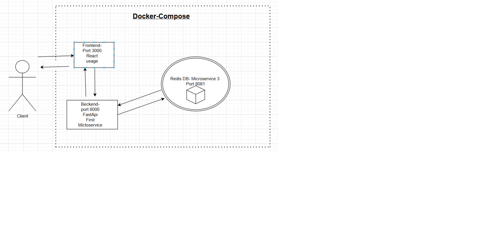

# 📋 Task Manager Application

<div align="center">

## 📺 Project Demo Video

[](https://youtu.be/34b12OvF7To)


A modern and efficient task management application built with React, FastAPI, and Redis.

[Features](#features) • [Installation](#installation) • [Quick Start](#quick-start) • [API Documentation](#api-endpoints) • [Testing](#testing)

</div>

## 🌟 Features

- ✨ Create, read, and delete tasks
- 🎯 Set task priority levels (1-5)
- ✅ Mark tasks as completed
- 🔄 Sort tasks by date, title, or priority
- 📅 Schedule tasks with start and end times
- ⏱️ Track task duration
- 📱 Modern and responsive UI

## 🛠️ Installation

### Prerequisites

- Docker and Docker Compose
- Node.js (for local development)
- Python 3.8+ (for local development)
- PowerShell (for Windows) or Bash (for Unix)

### Clone the Repository

```
Download the zip file from github
```

## 🚀 Quick Start

1. Start the application using Docker:
   ```bash
   # Clean previous builds (if needed)
   docker-compose down
   docker system prune -af
   docker volume prune -f

   # Build and start
   docker-compose up --build
   ```

2. Access the application:
   - 🌐 Frontend: http://localhost:3000
   - 🔧 Backend API: http://localhost:8000
   - 📊 Redis Commander: http://localhost:8081

## 💻 Development Setup

### Frontend (React)

```bash
cd frontend
npm install
npm start
```

### Backend (FastAPI)

```bash
cd backend
pip install -r requirements.txt
uvicorn app.main:app --reload
```

## 🔌 API Endpoints

| Method | Endpoint | Description |
|--------|----------|-------------|
| GET    | /tasks   | Get all tasks |
| POST   | /tasks   | Create a new task |
| DELETE | /tasks/{task_id} | Delete a task |

## 🔧 PowerShell Commands for API Interaction

**1. Get all tasks:**
```powershell
Invoke-RestMethod http://localhost:8000/tasks
```

**2. Create a new task:**
```powershell
$body = @{
    "title" = "New Task"
    "description" = "Task description"
    "priority" = 3
    "start_time" = "2025-02-28T21:00:00+00:00"
} | ConvertTo-Json

Invoke-RestMethod -Method POST -Uri "http://localhost:8000/tasks" -Body $body -ContentType "application/json"
```

**3. Delete a task:**
```powershell
Invoke-RestMethod -Method DELETE http://localhost:8000/tasks/{id}
```

## 🧪 Testing

Make sure Docker containers are running:
```bash
docker-compose up -d
```

Run backend tests:
```bash
docker-compose exec backend pytest -v
```

Run frontend tests:
```bash
docker-compose exec frontend npm test -- --watchAll=false
```

## 📁 Project Structure

<div align="center">
  
</div>

<pre style="background-color: #f6f8fa; padding: 16px; border-radius: 6px; font-family: monospace;">
📦 Task Manager
├── frontend/                  # React application
│   ├── public/
│   │   └── index.html
│   ├── src/
│   │   ├── components/
│   │   │   ├── 📄 About.js      # About page component
│   │   │   ├── 📄 CreateTask.js # Task creation form
│   │   │   ├── 📄 EditTask.js   # Task editing component
│   │   │   └── 📄 TaskList.js   # Main task display
│   │   ├── styles/
│   │   │   ├── 🎨 About.css
│   │   │   ├── 🎨 App.css
│   │   │   ├── 🎨 CreateTask.css
│   │   │   ├── 🎨 EditTask.css
│   │   │   └── 🎨 TaskList.css
│   │   ├── 📄 App.js            # Main application component
│   │   ├── 🎨 index.css
│   │   └── 📄 index.js          # Application entry point
│   ├── 🐳 Dockerfile            # Frontend container config
│   ├── 📦 package.json          # Dependencies and scripts
│   └── package-lock.json
├── backend/                   # FastAPI server
│   ├── app/
│   │   ├── __init__.py
│   │   ├── 💾 database.py       # Redis database connection
│   │   ├── 🚀 main.py           # API endpoints
│   │   ├── 📊 models.py         # Data models
│   │   └── 🧪 test_main.py      # API tests
│   ├── 🐳 Dockerfile            # Backend container config
│   └── 📦 requirements.txt      # Python dependencies
├── scripts/
│   └── 🧪 run_tests.ps1         # Test automation script
├── docker-compose.yml        # Container orchestration
├── .gitignore               # Git ignore patterns
└── README.md                # Project documentation
</pre>

## 📄 License

MIT License

## 👨‍💻 Author

Omer Trabulski

---
<div align="center">
Made with ❤️ using React, FastAPI, and Redis
</div> 
